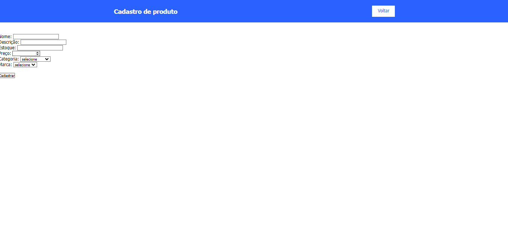
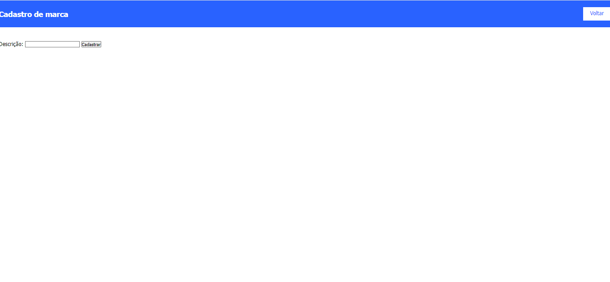
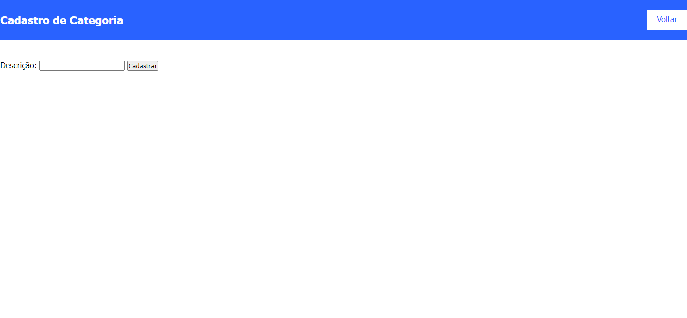

Este repositório contém o código para um sistema de cadastro de produtos, marcas e categorias. Abaixo estão documentados todos os métodos PHP utilizados, exemplos de uso, e imagens das telas da aplicação e do banco de dados.

## 📌 Tecnologias Utilizadas
- HTML5    
- CSS3   
- PHP 8.1   
- MySQL



### produto.php
```php
<?php
include_once('controller/conexao.php');
?>
<!DOCTYPE html>
<html lang="en">
<head>
    <meta charset="UTF-8">
    <meta http-equiv="X-UA-Compatible" content="IE=edge">
    <meta name="viewport" content="width=device-width, initial-scale=1.0">
    <title>Cadastro de produtos</title>
    <link rel="stylesheet" href="css/style.css">
</head>
<body>
    <header>
        <div class="center">
            <h1>Cadastro de produto</h1>
            <a href="index.php" target="_self">Voltar</a>
        </div>
    </header>
    <section id="produtos">
        <form action="insere-produto.php" method="post">
            Nome: <input type="text" name="nome"><br>
            Descrição: <input type="text" name="descricao"><br>
            Estoque: <input type="number" name="estoque"><br>
            Preço: <input type="number" name="preco" min="0.00" max="10000.00" step="0.01"><br>
            Categoria:
            <select name="seleciona_categoria" id="">
                <option value="">selecione</option>
                <?php
                    $resultado_categoria = "SELECT * FROM categoria";
                    $resultadocategoria = mysqli_query($mysqli, $resultado_categoria);
                    while($row_categorias = mysqli_fetch_assoc($resultadocategoria)){ ?>
                    <option value="<?php echo $row_categorias['IDCATEGORIA'] ?>">
                    <?php echo $row_categorias['DESCRICAO'] ?></option>
                <?php } ?>
            </select>
            <br>
            Marca:
            <select name="seleciona_marca" id="">
                <option value="">selecione</option>
                <?php
                    $resultado_marca = "SELECT * FROM marca";
                    $resultadomarca = mysqli_query($mysqli, $resultado_marca);
                    while($row_marcas = mysqli_fetch_assoc($resultadomarca)){ ?>
                    <option value="<?php echo $row_marcas['IDMARCA'] ?>">
                    <?php echo $row_marcas['DESCRICAO'] ?></option>
                <?php } ?>
            </select>
            <br><br>
            <input type="submit" value="Cadastrar">
        </form>
    </section>
</body>
</html>
```



### marca.pqp
'''php
<!DOCTYPE html>
<html lang="en">
<head>
    <meta charset="UTF-8">
    <meta http-equiv="X-UA-Compatible" content="IE=edge">
    <meta name="viewport" content="width=device-width, initial-scale=1.0">
    <title>Cadastro de marca</title>
    <link rel="stylesheet" href="css/style.css">
</head>
<body>
    <header>
        <div>
            <h1>Cadastro de marca</h1>
            <a href="index.php" target="_self">Voltar</a>
        </div>
    </header>
    <section id="produtos">
        <form action="insere-marca.php" method="post">
            <label for="">Descrição: </label>
            <input type="text" name="descricao">
            <input type="submit" value="Cadastrar">
        </form>
    </section>
</body>
</html>
```



### categoria.php

'''php
<!DOCTYPE html>
<html lang="en">
<head>
    <meta charset="UTF-8">
    <meta http-equiv="X-UA-Compatible" content="IE=edge">
    <meta name="viewport" content="width=device-width, initial-scale=1.0">
    <title>Cadastro de Categorias</title>
    <link rel="stylesheet" href="css/style.css">
</head>
<body>
    <header>
        <div>
            <h1>Cadastro de Categoria</h1>
            <a href="index.php" target="_self">Voltar</a>
        </div>
    </header>
    <section id="produtos">
        <form action="insere-categoria.php" method="post">
            <label for="">Descrição: </label>
            <input type="text" name="descricao">
            <input type="submit" value="Cadastrar">
        </form>
    </section>
</body>
</html>
```

## ✒️ Autores
[Alexsandro willian](https://github.com/christiandavid000)

